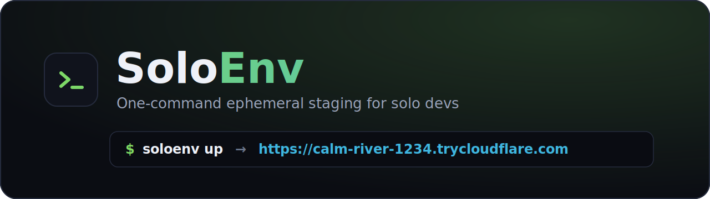
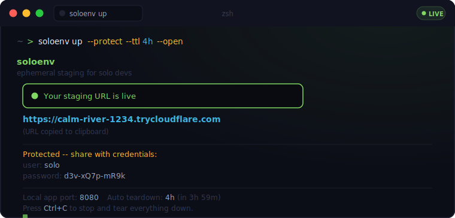
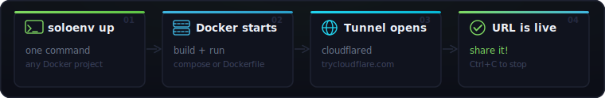
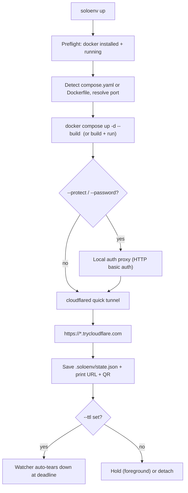

<div align="center">



### One-command ephemeral staging for solo devs

**Run your existing Docker app. Get a shareable public URL in seconds. Tear it down when you're done.**

No cloud account. No billing. No DevOps detour.

[](https://github.com/fleames/soloenv-cli/actions/workflows/ci.yml)
[](https://github.com/fleames/soloenv-cli/releases)
[](https://pkg.go.dev/github.com/fleames/soloenv-cli)
[](https://goreportcard.com/report/github.com/fleames/soloenv-cli)
[](LICENSE)
[](https://go.dev)

<br/>



</div>

---

## Table of contents

- [Why SoloEnv](#why-soloenv)
- [Features](#features)
- [Install](#install)
- [Quick start](#quick-start)
- [Commands](#commands)
- [Configuration](#configuration)
- [How it works](#how-it-works)
- [PR previews](#pr-previews)
- [Comparison](#comparison)
- [Limitations](#limitations)
- [Roadmap](#roadmap)
- [Contributing](#contributing)
- [License](#license)

## Why SoloEnv

You ship features fast — but realistic staging is still a weekend project. Wiring hosts, secrets, tunnels, and teardown is a detour you can't afford before you have paying users. So you skip it, and **production becomes the first place a feature meets the real world.**

SoloEnv collapses that whole detour into one command. It runs the Docker app you already have, opens a secure public tunnel, and hands you a link you can send to a client, a co-founder, or your own phone. When you're done, it disappears — nothing left running, nothing to pay for.

Built for **one-person teams**: indie hackers, freelancers, and solo founders — not platform teams.

## Features

<div align="center">

</div>

<br/>

- **One command** — `soloenv up` builds, runs, and exposes your app
- **Any Docker app** — works with your `compose.yaml` or `Dockerfile`, no rewrites
- **Public URL in seconds** — free [Cloudflare quick tunnel](https://developers.cloudflare.com/cloudflare-one/connections/connect-networks/do-more-with-tunnels/trycloudflare/), no account needed
- **Detached mode** — `--detach` keeps staging alive after you close the terminal
- **Password protection** — `--protect` / `--password` puts HTTP basic auth in front of the link
- **Auto teardown** — `--ttl 4h` expires the environment automatically
- **Realistic env** — auto-loads `.env.staging` so previews mirror production config
- **QR code + clipboard** — scan on mobile, URL copied for you
- **`open` / `logs` / `status`** — quality-of-life commands for a live environment
- **PR previews** — drop-in GitHub Action template
- **Single static binary** — written in Go, runs on macOS, Linux, and Windows

## Install

### Go (any platform)

```bash
go install github.com/fleames/soloenv-cli@latest
```

This installs a `soloenv-cli` binary into `$(go env GOPATH)/bin`. Rename or symlink it to `soloenv` if you like.

### From source

```bash
git clone https://github.com/fleames/soloenv-cli.git
cd soloenv-cli
go build -o soloenv .       # or soloenv.exe on Windows
```

### Prebuilt binaries

Grab the latest archive for your OS/arch from the [Releases page](https://github.com/fleames/soloenv-cli/releases) and put `soloenv` on your `PATH`.

> **Requirements:** [Docker](https://docs.docker.com/get-docker/) installed and running. `cloudflared` is downloaded automatically on first use if it isn't already on your `PATH`.

## Quick start

From any project with a `compose.yaml` or `Dockerfile`:

```bash
soloenv up
```

That's it — you get a public URL and a QR code. Press `Ctrl+C` to tear everything down.

Want it to keep running after you close the terminal, protected, and self-expiring?

```bash
soloenv up --detach --protect --ttl 4h --open
```

New here? The [`examples/`](examples/) folder has ready-to-run apps:

```bash
cd examples/static-site
soloenv up
```

## Commands

| Command | What it does |
|---------|--------------|
| `soloenv up` | Start app + tunnel, print the public URL, hold until `Ctrl+C` |
| `soloenv up --detach` | Same, but return to your shell; env keeps running |
| `soloenv up --protect` | Add basic auth with an auto-generated password (shown once) |
| `soloenv up --password <pw>` | Add basic auth with your own password |
| `soloenv up --ttl 90m` | Auto teardown after a duration |
| `soloenv up --env-file .env.staging` | Use a specific env file |
| `soloenv up --open` | Open the URL in your browser when ready |
| `soloenv status` | Show URL, mode, uptime, auth, and expiry |
| `soloenv open` | Open the staging URL in your browser |
| `soloenv logs [-f]` | Stream application logs |
| `soloenv down` | Stop the tunnel and app, clear state |

Every command accepts `--dir <path>` to target a project folder other than the current directory.

### `up` flags

| Flag | Default | Description |
|------|---------|-------------|
| `-p, --port` | auto | Host port to expose publicly |
| `-s, --service` | auto | Compose service to expose when several publish ports |
| `-d, --detach` | `false` | Run in the background |
| `--protect` | `false` | Basic auth with a generated password |
| `--password` | — | Basic auth with a chosen password |
| `--ttl` | — | Auto teardown duration (e.g. `2h`, `45m`) |
| `--env-file` | auto | Env file for Docker |
| `--open` | `false` | Open the URL when ready |
| `--no-build` | `false` | Skip image build |

## Configuration

Drop an optional `soloenv.yml` next to your compose file or Dockerfile. CLI flags always override it. See [`soloenv.example.yml`](soloenv.example.yml).

```yaml
port: 8080
service: web
build: true
env_file: .env.staging
password: my-secret-preview
auth_user: reviewer
ttl: 4h
```

Env files are auto-detected in this order when not set: `.env.staging`, then `.env.soloenv`.

> Add `.soloenv/` to your project's `.gitignore` — it holds runtime state for the live environment.

## How it works

<div align="center">

</div>

<br/>



When you ask for protection, SoloEnv starts a tiny local reverse proxy that enforces HTTP basic auth and points the tunnel at the proxy instead of your app directly. State for the live environment lives in `.soloenv/state.json` so `status`, `logs`, `open`, and `down` can find it later.

For a deeper dive into the internals, see [`docs/ARCHITECTURE.md`](docs/ARCHITECTURE.md).

[](https://launchpadly.co/)

## PR previews

Copy [`templates/github-preview.yml`](templates/github-preview.yml) to `.github/workflows/soloenv-preview.yml`, adjust the install step for your distribution, and every pull request gets a preview URL posted as a comment — with optional `--ttl` auto-expiry and teardown on close.

## Comparison

| | SoloEnv | ngrok | Vercel/Netlify | PaaS preview envs |
|---|:---:|:---:|:---:|:---:|
| Any Docker app | ✅ | ➖ (tunnel only) | ❌ (frontend-centric) | ✅ |
| No cloud account | ✅ | ⚠️ | ❌ | ❌ |
| One command | ✅ | ✅ | ⚠️ | ❌ |
| Auto teardown | ✅ | ❌ | ✅ | ⚠️ |
| Password on link | ✅ | ⚠️ (paid) | ⚠️ | ✅ |
| Runs your full compose stack | ✅ | ❌ | ❌ | ✅ |
| Free | ✅ | ⚠️ | ⚠️ | ❌ |

SoloEnv is **tunnel-first**: the URL is live while the tunnel runs (foreground or detached). It is intentionally not a hosting platform.

## Limitations

- Quick tunnel URLs are random and change on each `up` (stable subdomains are on the roadmap).
- The public URL is live only while the tunnel process runs.
- Single published HTTP port per environment in this version.

## Roadmap

- [ ] Stable named subdomains (Cloudflare named tunnels)
- [ ] Remote driver — laptop-off previews on a cheap VM
- [ ] Ephemeral database sidecar for compose
- [ ] Request inspector / replay
- [ ] Homebrew + Scoop + `winget` packages

See [open issues](https://github.com/fleames/soloenv-cli/issues) and the [changelog](CHANGELOG.md).

## Contributing

Contributions are welcome! Please read [CONTRIBUTING.md](CONTRIBUTING.md) and our [Code of Conduct](CODE_OF_CONDUCT.md) before opening a PR. To report a security issue, see [SECURITY.md](SECURITY.md).

```bash
make build   # build the binary
make test    # run tests
make check   # fmt + vet + test
```

## License

[MIT](LICENSE) © SoloEnv contributors
