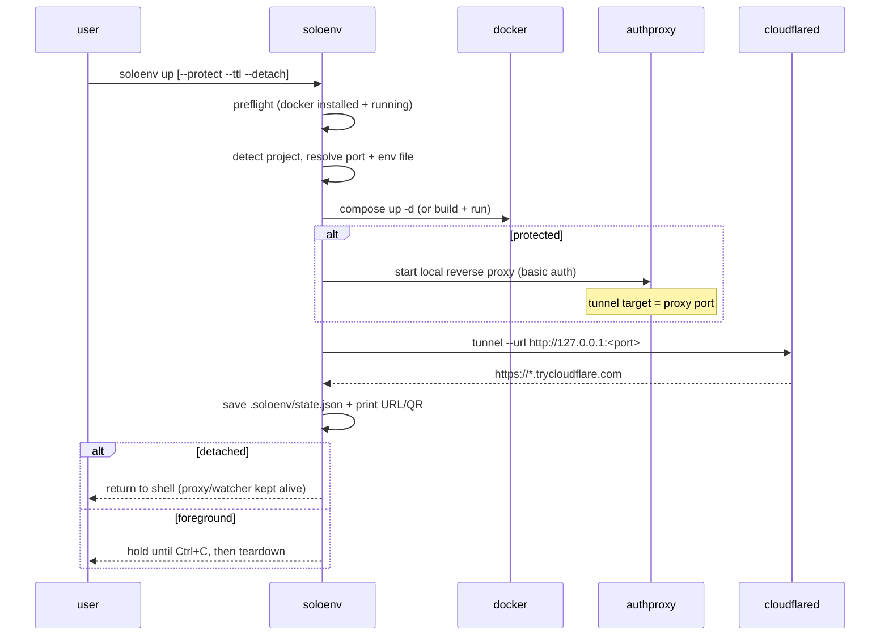

# Architecture

SoloEnv is a small Go CLI that orchestrates tools you already have (Docker) and a
free tunnel (Cloudflare quick tunnel) to turn a local app into a shareable URL.

## Goals

- **One command** to a public URL; **one command** to tear down.
- **No lock-in**: shell out to the real `docker` / `docker compose` CLIs.
- **No mandatory accounts**: default path uses Cloudflare quick tunnels.
- **Predictable cleanup**: everything is tracked in `.soloenv/state.json`.

## Package map

```
main.go                 entrypoint -> cmd.Execute()
cmd/                    cobra commands + OS-specific process helpers
  up.go                 the full up flow (build, proxy, tunnel, ttl, output)
  down.go status.go     lifecycle + inspection
  open.go logs.go       quality-of-life commands
  hold.go watch.go      detached helpers (auth proxy keeper, ttl watcher)
  detach_*.go           per-OS process detachment (Setsid / CREATE flags)
  signal_*.go           per-OS process liveness checks
internal/
  preflight/            verifies docker is installed and the daemon is up
  project/              detect compose vs Dockerfile; parse port/env/auth/ttl
  docker/               thin wrappers over docker / docker compose
  authproxy/            localhost reverse proxy with optional HTTP basic auth
  tunnel/               download + run cloudflared, parse the public URL
  output/              banner, boxed URL, QR code, clipboard
  state/                .soloenv/state.json read/write + TTL helpers
templates/              drop-in CI templates (PR previews)
examples/               runnable sample apps
```

## The `up` flow



## Detached mode

Foreground mode is simple: the `soloenv` process owns the `cloudflared` child and
(optionally) an in-process auth proxy, and tears everything down on `Ctrl+C`.

Detached mode has to keep things alive after the parent exits:

- **Tunnel**: `cloudflared` is started as a normal child; its PID is recorded.
- **Auth proxy**: re-launched as a detached `soloenv hold` subprocess (the in-process
  proxy would die with the parent). It prints its chosen port back to the parent.
- **TTL watcher**: a detached `soloenv watch --dir --until` subprocess sleeps until
  the deadline, then runs the same teardown path.

Process detachment is OS-specific:

- Unix: `SysProcAttr{Setsid: true}`
- Windows: `CREATE_NEW_PROCESS_GROUP | DETACHED_PROCESS`

`down` reads the recorded PIDs and signals each, then `docker compose down` (or
`docker rm -f`) and finally removes `.soloenv/`.

## State

`.soloenv/state.json` is the single source of truth for a running environment:
URL, tunnel/proxy/watcher PIDs, app port, mode (compose/dockerfile), compose file
or container id, auth info, detached flag, and the TTL deadline. Keeping it
per-project lets you run independent environments from different folders and
target them with `--dir`.

## Why a local auth proxy?

Cloudflare quick tunnels don't provide auth. Rather than depend on a paid tier or
a named tunnel, SoloEnv puts a tiny `net/http/httputil` reverse proxy in front of
the app and points the tunnel at the proxy. This keeps the "no account" promise
while still letting you hand out a password-protected link.

## Extensibility (future)

The `project` detector and the `tunnel` package are deliberately separated from
`cmd` so that an alternative driver (for example, a remote VM that runs the image
and returns a hosted URL) can be added without touching the command layer.
